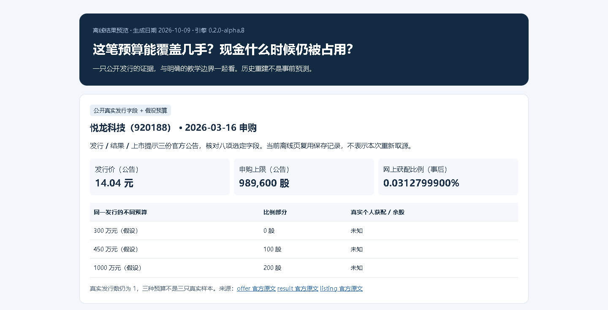

# 北交所打新研究引擎

计算不同申购预算下的比例获配、资金占用和现金缺口，并把公告事实与假设分开保存。

当前版本：[v0.2.0-alpha.13](https://github.com/KILING-TASI/bjx-ipo-engine/releases/tag/v0.2.0-alpha.13)。完整源码、wheel、sdist 和校验清单在同一发布页；历史报告及旧下载包按各自版本阅读。

自然语言使用：保留完整仓库资源，按 [Skill 指引](SKILL.md)注册到支持本地 Skill 的助手；CLI 安装与 Skill 注册分别完成。可以独立使用，无需工作台。

## 先看一份教学报告

完整源码解压后，需要 Python 3.10+。Windows 可运行 `Start-Demo.cmd`；或在源码目录执行 `python try_demo.py`。Linux/macOS 用 `sh Start-Demo.sh`。不需要先执行 pip 安装，不自动下载数据或覆盖旧报告；缺 Python 会提示处理路径。

换成自己的资料，先看[中文资料准备与错误处理](BEGINNER.md)。已安装 CLI 可运行 `bjx-ipo-engine doctor` 检查软件环境；它不检查资料或认证来源。

## 安装和首次试用

本轮对应[发布页](https://github.com/KILING-TASI/bjx-ipo-engine/releases/tag/v0.2.0-alpha.13)；下载时以实际上传的完整源码、wheel、sdist 与校验清单为准。源码按下面步骤安装；下载 wheel 后，将安装命令末尾的 `.` 换成该 wheel 文件路径。pip 安装不会自动注册 AI 工具中的 Skill。

本轮源码版本为 `0.2.0a13`。统一安装入口需要 Python 3.10 或以上。在完整源码目录新建自己的 Python 环境，下面的 Windows 命令不需要激活脚本：

```powershell
python -m venv .venv
.\.venv\Scripts\python.exe -m pip install .
.\.venv\Scripts\bjx-ipo-engine.exe --help
.\.venv\Scripts\bjx-ipo-engine.exe demo --out-dir reports/demo --auto-name
```

工具名与仓库名相同；在已激活的环境中可以直接输入工具名。Linux/macOS 使用 `.venv/bin/python` 和 `.venv/bin/bjx-ipo-engine`。教学结果写入当前工作目录；`--auto-name` 自动另选新名字，旧结果保留。不加该参数时，教学入口拒绝已有目录。`bjx-ipo-engine run --help` 查看原生参数，原来的命令继续兼容。本仓提供独立 CLI，并新增 [Skill 调用指引](SKILL.md)；Skill 使用须保留完整仓库资源，pip 不会自动注册。安装可能需要联网获取普通构建依赖；教学离线。下面保留原生入口及此前发行记录，本轮安装和版本以本节为准。

## 最短试用

需要 Python 3.10 或以上。从 GitHub 下载或克隆本仓，在完整仓库根目录打开 Windows PowerShell：

```powershell
python -S demo.py --out-dir local-data/demo-01
```

这一步只用标准库，不安装其他项目，也不联网。完成后打开 `local-data/demo-01/index.html`，同目录保存输入、结果和摘要清单。目录已存在时换一个新名字，例如 `demo-02`；不会覆盖旧结果。

## 实际结果示例

**预算增加不一定多获配一手，退款公告也不能直接当作资金到账证明。** 示例复用悦龙科技（920188）的公开发行字段，比较三种假设预算；个人余股、实际到账和收益仍未知。



[完整截图与生成说明](docs/preview-guide.md) · [保存的 HTML 示例](docs/preview/index.html) · [示例输入](docs/preview/input.json)

截图是已保存的历史报告；当前源码生成的页面还包含多方案比较和公开回购参考。GitHub 不一定直接显示 HTML，下载后在本地打开。教学预算、费用和现金日期不算真实账户验证。

## 能做什么，暂不支持什么

| 想核对的问题 | 当前能做的事 |
|---|---|
| 预算够不够跨过百股阶梯 | 按发行价、申购上限和百股单位取整，计算声明配售率下的比例整手 |
| 收益会受哪些条件影响 | 比较明确的配售率、涨幅、费用和机会成本；余股额外百股只作为条件情景 |
| 多只新股会不会撞资 | 按明确日期记冻结、退款、留存本金和卖出回款，保留资金不足与同日顺序不明的缺口 |
| 不同资金方案怎么比较 | 在同本金、同期间下比较声明方案；单列一条公开回购定盘参考及假设费用 |
| 公告字段从哪里来 | 保存来源、原件摘要、选定字段和更正线索，区分公告日期、取得时间及未知可得时点 |
| 日期是否有依据 | 使用2026年北交所计划交易日历，逐案核对申购、公告退款和上市日期 |

暂不支持自动申购或交易、个人余股排序预测、完整年度收益回放、经过校准的中签率预测。计划交易日不认证实际开市或券商到账；缺失费用和日期不填零，冲突来源不自动选值。真实账号验收由用户暂停。

金额用人民币，股数用股，收益率与费率用小数，例如 `0.0005` 表示0.05%。公告退款日、退款资金可用日、上市日和卖出现金可用日分别输入。详细口径见 [现金账](docs/cash-and-evidence.md)、[情景与敏感性](docs/scenario-sensitivity.md)和 [方法说明](docs/funding-history-methods.md)。

## 独立使用与项目身份

本仓是独立 Python 计算引擎，提供 CLI 和 JSON 接口；另提供 [Skill 调用指引](SKILL.md)，注册时须保留完整本仓资源。无需安装其他自家专业仓。[research-workbench](https://github.com/KILING-TASI/research-workbench)可以调用它，并负责公司经营研究、综合判断和报告组织；工作台不是本引擎的运行依赖。

源码最短试用无需安装。需要安装计算模块时，在本仓根目录执行：

```powershell
python -m venv .venv
.\.venv\Scripts\python.exe -m pip install .
```

构建依赖为 setuptools>=77，安装时可能联网取得；计算运行无普通第三方依赖。wheel只含计算模块，demo、示例和公开字段资源需使用完整本仓源码。已安装模块可用 `python -I -m api` 接收完整 JSON 请求，格式见 [接口说明](docs/workbench-contract.md)。

只有 PDF 原文核对需要可选组件：

```powershell
.\.venv\Scripts\python.exe -m pip install ".[pdf]"
```

声明版本为 pypdf==6.14.2。运行 PDF 入口时不要加 `-S`，否则已安装组件不可见。主动获取来源需显式使用 `capture --online`，不会自动下载私人或付费资料。安装与独立使用的实际验收范围见 [单仓验收](docs/standalone-acceptance.md)。

其他可复制的离线入口：

```powershell
python bjx.py public-sample examples/public-sample.json --out-dir local-data/yuelong-01
python bjx.py compare-plans examples/compare-plans.json --out-dir local-data/plans-01
python -S .github/scripts/check_scenarios.py --out-dir local-data/scenarios-01
```

前两项输出目录含 `report.md`、`report.html`、输入、结果和摘要；情景验收输出另含预期值与实际回执。[实例索引](docs/scenario-acceptance.md)包括预算阶梯、余股未知、费用、资金不足和逐案日期边界。机器入口保持 JSON 输出，失败原因和下一步保存在报告中。

## 当前源码与旧发行包

截至2026-10-10，main已集成多方案比较、公开回购参考、接口联调、独立安装及情景验收、中文使用提示；计算核心版本仍为 `0.2.0-alpha.8`，接口为 `1.0`，没有为了文案升级版本。

当前软件发行版为 **v0.2.0-alpha.9**（Python包版本 `0.2.0a9`），[下载源码ZIP、wheel或sdist](https://github.com/KILING-TASI/bjx-ipo-engine/releases/tag/v0.2.0-alpha.9)。源码ZIP和sdist含demo/示例资源，wheel仅计算模块。软件发布版本与计算核心方法版本分别记录，核心仍为 `0.2.0-alpha.8`、接口仍为 `1.0`。

旧功能版 [v0.2.0-alpha.8](https://github.com/KILING-TASI/bjx-ipo-engine/releases/tag/v0.2.0-alpha.8)，另有文档更新版。旧Release资产保持冻结，不包含后续main全部增量；本页命令面向当前main的完整源码。查看 [发行历史](https://github.com/KILING-TASI/bjx-ipo-engine/releases)、[变更记录](CHANGELOG.md)和 [开发记录](docs/progress.md)。

## 验证、来源与许可

已完成 Windows/Linux、Python3.10/3.12工程检查，以及单仓源码归档和非editable wheel实际运行。情景验收包含手算或现金守恒预期；CI通过不等于投资有效、资料完整或账户收益已认证。

真实公开发行覆盖仍为一只、八项选定字段，另有一条回购定盘参考。第一份公告已在北交、规则端和工作台实际复用，但不代表所有仓库的数据已统一。完整更正链、可信历史首次公开时刻及全部报告视觉验收仍未完成。

- [公开发行样本与来源](docs/public-sample-920188.md) · [日历核验范围](docs/calendar-verification.md) · [公开回购参考](docs/public-repo-reference.md)
- [公告复用验收](docs/announcement-reuse.md) · [数据入口与版本说明](docs/data-contract-inventory.md) · [后续路线](docs/roadmap.md)

[](LICENSE)

原创代码和有权授权的原创说明采用 [MIT许可](LICENSE)。两个复用公告模块保留 [research-workbench原许可](licenses/research-workbench-MIT.txt)；第三方公告、行情、研报和外部组件的权利独立，代码许可不授予其数据使用权，详见 [第三方说明](THIRD_PARTY_NOTICES.md)。不发布原始公告PDF、账户材料或私人缓存。

仅供学习与研究，不构成投资建议或交易指令；使用前核对本次来源、日期与假设，详见 [使用边界](DISCLAIMER.md)。

构建记录与版本边界见 [alpha.9发布准备](docs/release-alpha9.md)。

## 自然语言使用

向已注册本仓 Skill 的助手直接提问。助手整理输入、调用计算并先回答能确定的部分，再解释依据和缺口；无需安装工作台。新增指引自 v0.2.0-alpha.12 随包提供；更早的发行包保持原样。

## 本轮验证范围

源码教学启动、软件环境查询和安装后教学入口分别验证；软件就绪不等于真实资料已取得。中文问答需要助手按本仓Skill准备已声明输入，没有宣称任意自然语言自动发现或全市场数据闭环。旧报告、历史tag与案例证据保留。
