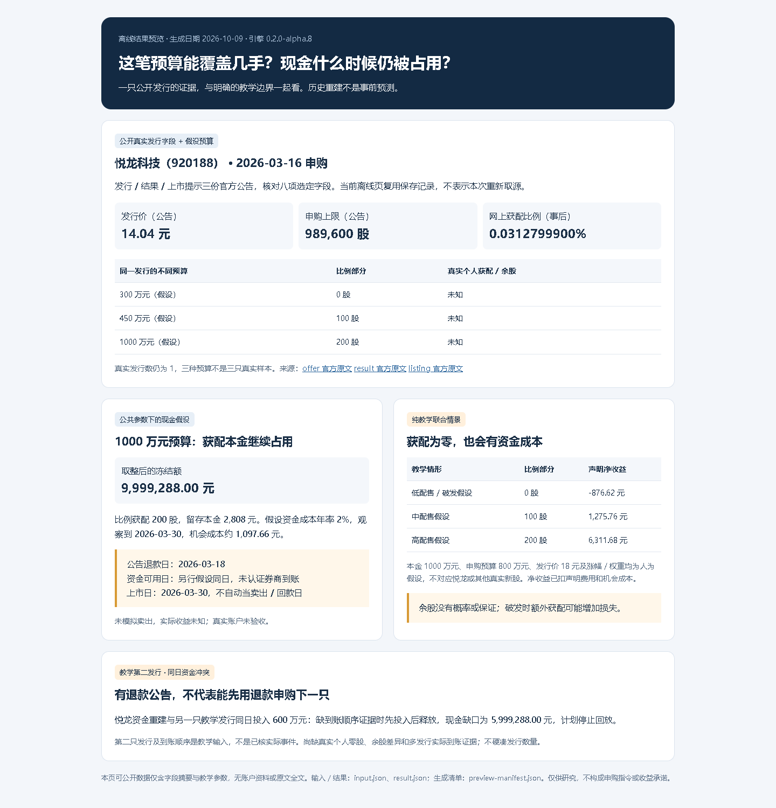

# 实际结果预览与离线 demo

生成与截图日期：2026-10-09。计算版本仍为 0.2.0-alpha.8；本次展示和许可改动在主分支，尚未发布新版本。

## 最短示例

在完整仓库目录中，Python 3.10 及以上，不联网、不需要可选 PDF 组件：

```bash
python -S demo.py --out-dir local-data/demo-01
```

打开新目录的 index.html。input.json、result.json 与 preview-manifest.json保存本次输入、结果、版本、日期和摘要。目录必须不存在，再次运行换新名称；不覆盖旧研究。当前 demo 以仓库目录为起点，不能将不完整脚本复制到任意目录运行。

## 实际截图与可运行页面



[保存的 HTML 预览](preview/index.html) · [截图对应输入](preview/input.json) · [计算结果](preview/result.json) · [截图记录](screenshots/capture.json)。GitHub 文件页面未必直接渲染 HTML；下载完整仓库后本地打开，或运行上面的 demo。不是 AI 生成图片。

截图来自实际 HTML，由本机 Chrome 无界面全页截取。已查看页图：公开字段、两个表格、预算和日期假设、教学冲突与页脚都可见，无横向溢出。此检查只覆盖这张 1440 像素宽截图，不认证所有设备或所有报告排版。

## 覆盖与限制贴近结果

- 公开真实发行只有悦龙科技一只、八项选定字段。三种预算是同一发行的条件情景，不计作三只真实样本；当前离线页复用核验记录，不代表重新取源。
- 300/450/1000万元假设预算分别为0/100/200股比例部分；真实个人获配与余股未知，低于比例门槛不等于保证零获配。
- 公告退款日为2026-03-18；资金可用日另假设同日。上市日2026-03-30不当作卖出到账，留存本金继续占用，实际收益不计算。
- 另一组联合配售/涨幅、费用和权重是纯教学参数，与悦龙发行无关；教学第二发行现金冲突也不计真实事件。
- 历史补录是重建，不是事前预测；真实个人余股、第二个已核发行、多发行实际到账仍为真实缺口，真实账户未验收。

公开预览没有原公告全文或页图、账户、私人缓存、字体文件、第三方品牌图像。只展示现有数值摘要与教学参数；底层来源、数据与第三方材料的权利独立于 MIT，见[许可范围](../THIRD_PARTY_NOTICES.md)。
